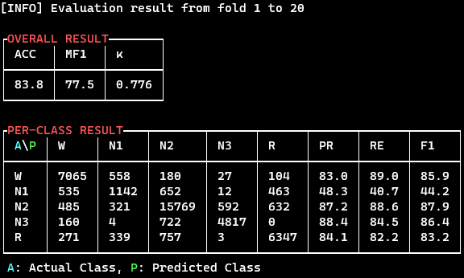

# MFM

## Getting Started
### Environment 
* python >=3.7.0
* pytorch >= 1.7.0 (or compatible version to your develop env)
* numpy
* scikit-learn
* pandas
* mne
* terminaltables
* termcolor

1. Install PyTorch with compatible version to your develop env from [PyTorch official website](https://pytorch.org/).
2. Install remaining libraries using the following command.
    ```
    pip install -r requirements.txt
    ```


### Data Preparation
We evaluated our MFM with Sleep-EDF dataset. You have to convert dataset from ```.edf``` into ```.npz``` format.

You can download SC subjects of Sleep-EDF using the following commands.
```
cd data
chmod +x download_physionet.sh
./download_physionet.sh
```


Second, preprocess ```.edf``` into ```.npz``` format using the following command. We referred ```prepare_physionet.py``` in [DeepSleepNet](https://github.com/akaraspt/deepsleepnet) repository.
```
python prepare_physionet.py
```

After preprocessing, the hierarchy of ```./datasets/``` directory will be the following:

```
./datasets/
├── MASS/
│   └── F4-EOG/
│       ├── 01-03-0001-PSG.npz
│       ├── ...
│       └── 01-03-0064-PSG.npz
├── SHHS/
│   └── C4-A1/
│       ├── shhs1-200001.npz
│       ├── ...
│       └── shhs1-205804.npz
└── Sleep-EDF/
    └── Fpz-Cz/
        ├── SC4001E0.npz
        ├── ...
        └── SC4192E0.npz
```

Each ```.npz``` file contains input eeg epochs with the shape of ```(total_num_epochs, 30 * sampling_rate)``` and target labels with the shape of ```(total_num_epochs)``` with the key ```'x'``` and ```'y'```, respectively.

## Train & Evaluation
You can simply train and evaluate IITNet using just ```main.py```.
```
$ python main.py --config $CONFIG_PATH --gpu $GPU_IDs
```

For evaluation only, add ```--test-only``` argument when you run the script 


### Example Commands ###
* Train and Evaluation MASS (```L=1```) using single GPU (```gpu_id=0```)
```
$ python main.py --config ./configs/IITNet_MASS_SL-01.json --gpu 0
```
* Train and Evaluation Sleep-EDF (```L=10```) using multiple GPUs (```gpu_id=1,2```)
```
$ python main.py --config ./configs/IITNet_Sleep-EDF_SL-10.json --gpu 1,2
```
* Evalution trained SHHS (```L=10```) using single GPU (```gpu_id=3```)
```
$ python main.py --config ./configs/IITNet_SHHS_SL-10.json --gpu 3 --test-only
```

### Outputs ###
* For each fold, checkpoints that have the best validation loss are saved at ```./checkpoints/CONFIG_NAME/```.
* Overall result is written in ```./results/CONFIG_NAME.txt``` with the order of ```FOLD ACC MF1 KAPPA W-F1 N1-F1 N2-F1 N3-F1 REM-F1```.
* Overall and per-class results are printed like the following figures:

